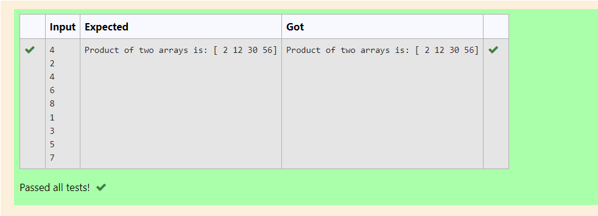

# Multiplying-two-matrix

## AIM:
To write a python program for multiplying two matrices.
## ALGORITHM:

### Step 1:
Import numpy as np.
### Step 2:
Create a empty list.
### Step 3:
Using for loops append the two lists.
### Step 4:
Assign the arrays.
### Step 5:
Display the result.

## PROGRAM: 

~~~
# To write a python program for Multiplying two matrices.
# Developed by : Ragul AC
# Register Number : 212221240042
import numpy as np
l1,l2=[],[]
n=int(input())
for i in range(n):
    l1.append(int(input()))
for i in range(n):
    l2.append(int(input()))
A=np.array(l1)
B=np.array(l2)
result=(A*B)
print("Product of two arrays is:",result)
~~~

## OUTPUT:

## RESULT:

Python program for multiplying two matrices is successful.
